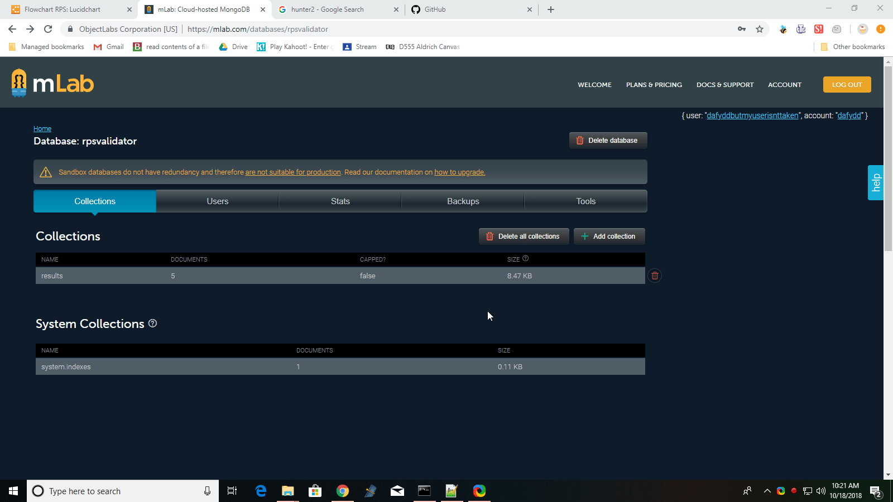

# ProvablyFairRPS
Provably Fair Rock Paper Scissors using .pyc files

## How to use

Edit rps.py and validator.py and insert your MongoDB credentials.
Run `py -m py_compile validator.py` and `py -m py_compile rps.py` to create .pyc files to encrypt your MongoDB addresses, and give those to the players!

## DB structure

